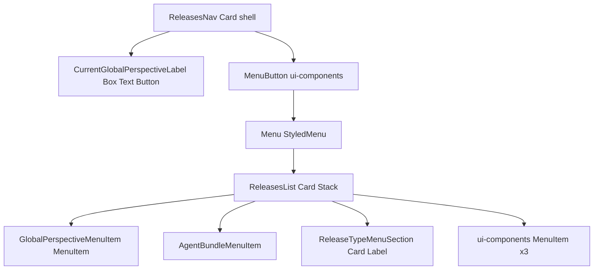

# Global perspective picker — visual treatment reference

This document maps the **global release / perspective picker** in the Studio navbar to **Sanity UI primitives**, **studio `ui-components` wrappers**, **icons**, and **styled layers**. Use it to recreate the look in isolation (Storybook, prototypes, or another surface) without wiring perspective state, routing, or data hooks.

**Implementation roots**

- Shell: [`ReleasesNav.tsx`](./ReleasesNav.tsx)
- Menu: [`GlobalPerspectiveMenu.tsx`](./GlobalPerspectiveMenu.tsx) → [`ReleasesList.tsx`](./ReleasesList.tsx)

---

## What this UI does (current behaviour)

The picker controls the **global perspective**: which **content layer** the Studio uses when showing documents, lists, and previews (published vs drafts vs a specific **release** or **agent bundle**). Changing the selection updates that perspective across the desk, not just a single pane.

| Part | Meaning |
|------|--------|
| **Label** (next to the chevron) | Shows the **active** perspective name: Published, Drafts, a release title, or an agent-bundle label (e.g. “Proposed changes”). For an active release it can act as a **link** into the releases tool for that release. |
| **Published / Drafts** | Switches between viewing **published** content and the **draft / latest** editing layer (Drafts is omitted when the workspace disables the draft model). |
| **Proposed changes** (agent row) | When present, selects an **agent bundle** perspective so the Studio reflects that bundle’s proposed edits. |
| **Grouped releases** | Lists **active releases** in three sections (only sections with at least one release are shown). Headers use the default Studio strings: **`release.type.asap`** → “As soon as possible”, **`release.type.scheduled`** → “At time”, **`release.type.undecided`** → “Undecided”. Choosing a release sets the global perspective to that bundle. **Scheduled** rows can show **publish / intended** date hints; other types use the same row chrome with type-appropriate **avatar** icons (bolt / clock / dot). |
| **Vertical connector** (line through dots) | **Visual only** in terms of styling: it reflects which layers are in the **current perspective range** (published → drafts → … → selected release) so users see how layers stack; it does not change behaviour by itself. |
| **Hide layer** (eye, when shown) | Toggles whether a layer is **excluded** from the perspective stack (still a perspective choice, not just chrome). |
| **View Scheduled Drafts** | Navigates to the **scheduled drafts** intent (single-doc release feature) when that feature set is enabled. |
| **View Content Releases** | Opens the **releases / schedules** tool overview. |
| **New release** | Opens **create release** (or an upsell flow if releases are gated). Disabled states cover **permissions** and **workspace release limits**. |

The **chevron** opens the menu; **Create release** may also open from upsell logic instead of the dialog when appropriate.

---

## Visual anatomy (appearance)

This is a **purely visual** walkthrough of what users see: shapes, grouping, typography roles, and iconography. **Colours** (selected row, dots, icons) come from the **active Sanity theme** (`@sanity/ui` tokens such as `--card-*`, `--card-badge-*-icon-color`, menu **selected** / **pressed** styles), not from fixed hex values in these components.

### A. Navbar control (closed state)

The whole control sits in a **single horizontal pill**: a `Card` with **`radius="full"`**, **thin border**, and **inherit** tone so it matches the top bar.

| Zone (left → right) | What it looks like | Notes |
|---------------------|-------------------|--------|
| **Releases shortcut** (optional) | A **circular bleed button** (`radius="full"`, `mode="bleed"`). The **icon** is [`ReleaseAvatarIcon`](../../releases/components/ReleaseAvatar.tsx) for the **current** perspective: e.g. **filled dot** (published / drafts use tone-coloured dots), **bolt**, or **clock** for releases—not a generic “calendar” glyph for the icon slot. A small **red dot** can appear on this control when there are release **errors** (`Dot` with critical badge colour). | Only rendered when `withReleasesToolButton` and the releases tool is available ([`ReleasesNav.tsx`](./ReleasesNav.tsx), [`ReleasesToolLink.tsx`](../ReleasesToolLink.tsx)). |
| **Perspective label** | **Single line** of **medium**-weight text (`size={1}`), **ellipsis** if long. For Published/Drafts/agent names it is **plain text in a padded box**; for an **active release** it can look like a **second pill-shaped control** (`Button` as link, bleed, full radius, max width). | [`currentGlobalPerspectiveLabel.tsx`](./currentGlobalPerspectiveLabel.tsx). |
| **Menu trigger** | **Bleed button**, **pill** radius, **chevron-down** on the **right**. Visually reads as the “open list” control next to the label. | [`GlobalPerspectiveMenu.tsx`](./GlobalPerspectiveMenu.tsx). |

**Hit targets:** [`oversizedButtonStyle`](../styles.ts) expands the clickable area slightly **outside** the visible pill (`::before` inset `-4px`) for the trigger (and link styled with the same helper).

### B. Dropdown container

| Aspect | Appearance |
|--------|------------|
| **Shape** | **Rounded rectangle**: content is a **`Card`** with **`radius={3}`** inside the menu. |
| **Width** | Menu surface clamped (**min ~200px**, **max ~320px**). |
| **Shadow / border** | Standard **popover / card** treatment from the theme (menu is portalled with `tone: 'default'`). |
| **Overflow** | Popover uses **`overflow: hidden`** so sticky header/footer clip cleanly with the middle scroll area. |
| **Structure** | **Four logical bands** separated by **horizontal rules** (`borderBottom` / `borderTop` on inner cards): (1) Published + Drafts, (2) optional agent row, (3) scrollable release groups, (4) footer actions. |

### C. Top band — Published and Drafts

| Element | Appearance |
|---------|------------|
| **Rows** | Same **row height** and **left icon column** as other primary rows; icons are **small** (`Text size={1}`) with tone-driven **dot / bolt / clock** for system layers. |
| **Connector** | A **thin vertical line** (`var(--card-border-color)`) runs through the **left gutter**, linking rows that belong to the **current perspective range**; **dots** sit on the line with a **circular “knockout”** behind the icon so the line does not show through. |
| **Selected row** | **`MenuItem`** with **`pressed`** + **`selected`**: **filled highlight** and **contrasting** label/icon colours per theme (reads as the active perspective). |
| **Sticky header** | This band uses a **sticky top** card with **solid card background** so it stays visible while the middle list scrolls. |

### D. Agent band — “Proposed changes”

| Element | Appearance |
|---------|------------|
| **Row** | Same **two-column** feel as release rows: **left**: **sparkle** icon tinted with **`--card-badge-suggest-icon-color`**; **right**: **medium** primary line, no subtitle unless you add one in a fork. |
| **Separation** | **Border bottom** under this block when present. |

### E. Middle band — grouped releases

| Element | Appearance |
|---------|------------|
| **Group header** | **Uppercase**, **muted**, **small** label (`Label size={1}`)—e.g. “AS SOON AS POSSIBLE”, “AT TIME”, “UNDECIDED” in the default locale. **Extra left padding** so the header aligns with the text column of rows; when the timeline runs through this group, a **continuation segment** of the vertical line can appear beside the header. |
| **Release rows** | **Primary line**: **medium** title (`size={1}`). **Secondary line** (optional): **muted** `size={1}` **date** for **scheduled** releases. **Leading icon**: **bolt / clock / dot** via `ReleaseAvatarIcon`, coloured by release tone. **Lock** icon may appear for scheduled/scheduling releases; **error** icon for failed active releases. **Eye** control appears only when the layer can be **hidden** from the stack. |
| **Scroll** | Only this **middle** section scrolls; header and footer bands stay **sticky**. Empty **release-type** sections are **omitted** entirely (no empty header). |

### F. Bottom band — actions

| Element | Appearance |
|---------|------------|
| **Rows** | **Studio `MenuItem`**: **icon left** (calendar or plus), **single line** of **medium** text, **slightly roomier** default padding than the custom `padding={1}` rows above—so footer items can read a touch **taller** and more “utility”. |
| **Separation** | **Border top** on the sticky footer card. |

### G. Loading state

While releases are loading, the menu shows a **centred muted spinner** in a padded flex region instead of the full list ([`ReleasesList.tsx`](./ReleasesList.tsx)).

---

## 1. Navbar shell

**File:** [`ReleasesNav.tsx`](./ReleasesNav.tsx)

| Source | Role |
|--------|------|
| `Card` (`@sanity/ui`) via `styled(Card)` | Container: `display: flex`, `align-items: center`, `gap: 2px`, `padding: 2px`, `margin: -3px 0`, `radius="full"`, `border`, `tone="inherit"` |
| `styled-components` | Hover z-index on nested `a` / `button`; absolute positioning for error icon inside button span |

**Label (current perspective name)**

**File:** [`currentGlobalPerspectiveLabel.tsx`](./currentGlobalPerspectiveLabel.tsx)

| Source | Role |
|--------|------|
| `Box`, `Text`, `Button` | `Box` + `Text` for Published/Drafts/agent label (`padding={2}`, `size={1}`, `weight="medium"`, `textOverflow="ellipsis"`) |
| `Button` (`as={IntentLink}`) | Release title chip: `mode="bleed"`, `padding={2}`, `radius="full"`, `maxWidth: 180px` |
| `styled(IntentLink)` | Shares [`oversizedButtonStyle`](../styles.ts) with the menu trigger |
| `motion/react` (`motion.div`) | **Not Sanity UI** — animates label width when text changes; safe to drop for a static visual port |

---

## 2. Trigger and popover

**File:** [`GlobalPerspectiveMenu.tsx`](./GlobalPerspectiveMenu.tsx)

| Source | Role |
|--------|------|
| [`MenuButton`](../../../ui-components/menuButton/MenuButton.tsx) | Wraps `@sanity/ui` `MenuButton`; forces `popover.animate: true` |
| `Button` (`@sanity/ui`) | Trigger: `mode="bleed"`, `padding={2}`, `radius="full"`, `iconRight={ChevronDownIcon}` |
| `styled(Button)` + [`oversizedButtonStyle`](../styles.ts) | Hit area: `::before` with `inset: -4px`, `border-radius: 9999px` |
| `Menu` (`@sanity/ui`) | `padding={0}`; `StyledMenu` sets `min-width: 200px`, `max-width: 320px`, zeroes gap on child `[data-ui='Stack']` |
| Popover props | `placement: 'bottom-end'`, `fallbackPlacements: ['bottom-end']`, `portal: true`, `constrainSize: true`, `tone: 'default'`, `zOffset: 3000`, `style: { overflow: 'hidden' }`, `__unstable_margins: [0, 0, 32, 0]` |

---

## 3. Menu body layout

**File:** [`ReleasesList.tsx`](./ReleasesList.tsx)

| Source | Role |
|--------|------|
| `Card` | Outer surface: `radius={3}` |
| `StickyTopCard` / `StickyBottomCard` | `styled(Card)`: `position: sticky`, `z-index: 2`, `background: var(--card-bg-color)`; top block `borderBottom` + `padding={1}`; bottom `borderTop` + `paddingY={1}` `paddingX={2}` |
| `Stack` | `space={1}` between rows inside sections |
| `Stack` (`data-ui="scroll-wrapper"`) | Middle column: receives ref for scroll / range visibility |
| `Flex` + `Spinner` | Loading: centered, `Spinner` with `muted` |

**Section order (visual)**

1. Sticky top: Published + Drafts (`GlobalPerspectiveMenuItem`)
2. Optional: Agent bundle block (`Card` `borderBottom` `padding={1}`)
3. Scrollable: release groups (`ReleaseTypeMenuSection`)
4. Sticky footer: link-style + create actions (`ui-components` `MenuItem`)

---

## 4. Primary rows (Published, Drafts, releases)

**File:** [`GlobalPerspectiveMenuItem.tsx`](./GlobalPerspectiveMenuItem.tsx)

| Source | Role |
|--------|------|
| `MenuItem` | `padding={1}`, `pressed` / `selected` mirror active perspective |
| `Flex` | `align="flex-start"`, `gap={1}` |
| `IconWrapperBox` (`styled(Box)`) | Icon column: `paddingX={3}` `paddingY={2}`, `border-radius: 50%`; SVG `background-color: var(--card-bg-color)` so the timeline line does not show through |
| `Text` | Wraps `ReleaseAvatarIcon`; `size={1}` |
| `Stack` | Title + optional date: `flex={1}`, `paddingY={2}` `paddingRight={2}`, `space={2}`, `maxWidth: 200px`, `minWidth: 0` |
| `Text` | Title `size={1}` `weight="medium"`; scheduled subtitle `muted` `size={1}` |
| `ToggleLayerButton` (`styled(Button)`) | `mode="bleed"`, `forwardedAs="div"`, opacity / hover rules for eye icon |
| `Tooltip` | From `ui-components` |
| `ToneIcon` | Error state: `ui-components`, `ErrorOutlineIcon`, `tone="critical"` |
| `LockIcon` | Scheduled / scheduling releases, in `Box` with `padding={2}` |

**Domain visuals (not generic Sanity UI)**

- [`ReleaseAvatarIcon`](../../releases/components/ReleaseAvatar.tsx): chooses `BoltIcon`, `ClockIcon`, or `DotIcon`; sets `--card-icon-color` to `var(--card-badge-<tone>-icon-color)` (drafts use caution tone for the dot).
- [`ReleaseTitle`](../../releases/components/ReleaseTitle.tsx): title text + truncation behavior for release documents.

---

## 5. Timeline / connector (CSS only)

**File:** [`PerspectiveLayerIndicator.tsx`](./PerspectiveLayerIndicator.tsx)

| Piece | Behavior |
|-------|----------|
| `GlobalPerspectiveMenuItemIndicator` (`styled.div`) | Positions vertical connector; uses `--indicator-left: 20px`, 1px width, `var(--card-border-color)`; `::before` / `::after` on child `[data-ui='MenuItem']` for line segments; `first` / `last` tweak radii and which pseudo-elements show |
| `GlobalPerspectiveMenuLabelIndicator` (`styled(Box)`) | Section headers: `padding-left: 41px`; optional `::before` continuation line when `$withinRange` |

These layers are **independent of Sanity UI components** beyond targeting `[data-ui='MenuItem']`.

---

## 6. Section headers (release types)

**File:** [`ReleaseTypeMenuSection.tsx`](./ReleaseTypeMenuSection.tsx)

Sections are rendered in order **`asap` → `scheduled` → `undecided`** ([`ReleasesList.tsx`](./ReleasesList.tsx) `orderedReleaseTypes`). Each header is a `Label` driven by `RELEASE_TYPE_LABELS`:

| Release type | i18n key | Default English |
|----------------|----------|-----------------|
| `asap` | `release.type.asap` | As soon as possible |
| `scheduled` | `release.type.scheduled` | At time |
| `undecided` | `release.type.undecided` | Undecided |

| Source | Role |
|--------|------|
| `Card` | `padding={1}` `borderBottom` |
| `Stack` | Spacing for header + list |
| `Label` | `muted`, `size={1}`, `textTransform: 'uppercase'` — strings from the table above |
| `Flex` | Column of `GlobalPerspectiveMenuItem` rows |

---

## 7. Agent “Proposed changes” row

**File:** [`AgentBundleMenuItem.tsx`](./AgentBundleMenuItem.tsx)

| Source | Role |
|--------|------|
| `MenuItem` | Same interaction pattern as primary rows: `padding={1}`, `pressed` / `selected` |
| `Flex` / `Box` / `Stack` / `Text` | Mirrors `GlobalPerspectiveMenuItem` spacing (`paddingX={3}` `paddingY={2}` on icon column, `maxWidth: 200px` on stack) |
| `SparkleIcon` | Icon color via `style={{ '--card-icon-color': 'var(--card-badge-suggest-icon-color)' }}` |

---

## 8. Footer actions

**Files:** [`ScheduledDraftsMenuItem.tsx`](./ScheduledDraftsMenuItem.tsx), [`ViewContentReleasesMenuItem.tsx`](./ViewContentReleasesMenuItem.tsx), [`CreateReleaseMenuItem.tsx`](../../releases/components/CreateReleaseMenuItem.tsx)

| Source | Role |
|--------|------|
| [`MenuItem`](../../../ui-components/menuItem/MenuItem.tsx) | Wraps `@sanity/ui` `MenuItem` with a fixed layout: `Flex align="center" gap={2}`, optional `icon` in `Box` + `Text size={1}`, `Stack` + `Text` for label (`weight="medium"`), optional `Badge` / hotkeys |
| Default padding on studio `MenuItem` | `paddingLeft={preview ? 1 : 3}`, `paddingRight={3}`, `paddingY={preview ? 1 : 3}` — **slightly different** from custom rows that pass `padding={1}` directly to `@sanity/ui` `MenuItem` |

Footer items use `icon` + `text` props (`CalendarIcon`, `AddIcon`) rather than fully custom children.

---

## 9. Icons inventory

| Icon | Where |
|------|--------|
| `ChevronDownIcon` | Menu trigger ([`GlobalPerspectiveMenu.tsx`](./GlobalPerspectiveMenu.tsx)) |
| `SparkleIcon` | Agent bundle row ([`AgentBundleMenuItem.tsx`](./AgentBundleMenuItem.tsx)) |
| `BoltIcon`, `ClockIcon`, `DotIcon` | Release type / perspective avatar ([`ReleaseAvatar.tsx`](../../releases/components/ReleaseAvatar.tsx)) |
| `ErrorOutlineIcon` | Release error state ([`GlobalPerspectiveMenuItem.tsx`](./GlobalPerspectiveMenuItem.tsx)) |
| `EyeOpenIcon`, `EyeClosedIcon` | Layer visibility toggle ([`GlobalPerspectiveMenuItem.tsx`](./GlobalPerspectiveMenuItem.tsx)) |
| `LockIcon` | Scheduled / scheduling release ([`GlobalPerspectiveMenuItem.tsx`](./GlobalPerspectiveMenuItem.tsx)) |
| `CalendarIcon` | Scheduled drafts + view releases footer items |
| `AddIcon` | New release footer item |

All icons above are from **`@sanity/icons`** except that they are composed through **`Text`** / **`ToneIcon`** in a few places.

---

## 10. Extracting purely visual treatment — checklist

- **Keep:** `@sanity/ui` `Card`, `Stack`, `Flex`, `Box`, `Text`, `Label`, `Button`, `Menu`, `MenuItem`, `MenuButton`, `Spinner`; studio `MenuButton` if you want identical popover animation defaults; `styled-components` rules in navbar + indicator files; theme CSS variables (`--card-bg-color`, `--card-border-color`, `--card-badge-*-icon-color`, etc.).
- **Replace with fixtures:** `usePerspective`, `useActiveReleases`, `useAgentBundles`, `useSetPerspective`, permission checks, and any router `IntentLink` / href resolution — use static labels and `onClick` no-ops.
- **Popover:** Preserve placement, `zOffset`, `overflow: hidden`, and width constraints if matching clipping and layering.
- **Optional omit:** `motion/react` width animation on the label; telemetry `useTelemetry` calls.
- **Sticky behavior:** Depends on a scroll parent with bounded height — the implementation uses `overflow: hidden` on the popover and an internal scroll wrapper for release sections.

---

## Component tree (reference)

---

## `@sanity/ui` primitives — summary table

| Primitive | Used in |
|-----------|---------|
| `Card` | `ReleasesNav`, `ReleasesList`, `ReleaseTypeMenuSection`, sticky variants |
| `Button` | Menu trigger, label link chip, visibility toggle |
| `Menu` / `MenuButton` | Dropdown surface and trigger wrapper |
| `MenuItem` | All rows (directly or via studio `MenuItem`) |
| `Stack` / `Flex` / `Box` | Layout throughout |
| `Text` / `Label` | Typography and section headers |
| `Spinner` | Loading state in `ReleasesList` |

**Studio-only (not re-exported as public package API here):** `MenuButton`, `MenuItem`, `Tooltip`, `ToneIcon` under `packages/sanity/src/ui-components/`.
